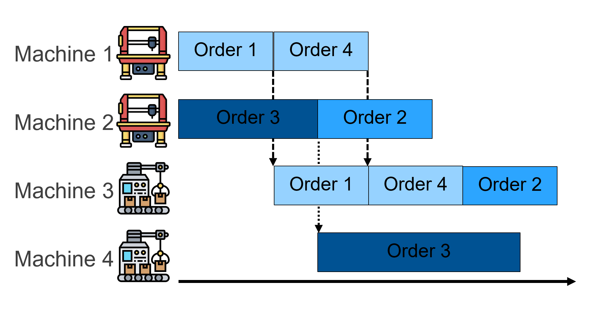

# SchedulingRL

This project is the code for the Paper: "CITE"

The aim is to provide a Reinforcement learning framework for stochastic scheduling problems. It aims to derive policies to conduct real-time scheduling. 

The policies can be trained to deal with a specific problem (everything but the uncertain events is known) or generic for a setting (e.g., machines are static but number of jobs etc. are not). 

The project consists of the following parts:

1. A simualtion for scheduling problems
2. A generator for Action space designs
3. Different Agents
i.e., priority functions created by Genetic programming (GP), Deep Reinforcement Learning (DRL) by either having actions or a parametrized priority functions as output

4. Generalizable Agents
5. Testing on many instances of
    1. Actions Spaces
    2. Agents
    3. Generalizability

Background:
1. Scheduling
Scheduling (e.g., [Job Shop scheduling](https://en.wikipedia.org/wiki/Job-shop_scheduling)) is the sequencing and routing of jobs on different resources (i.e. machines)

2. [Genetic Programming](https://en.wikipedia.org/wiki/Genetic_programming) 
3. [Deep Reinforcement learning](https://en.wikipedia.org/wiki/Deep_reinforcement_learning)

This is a good place to list differentiating factors.